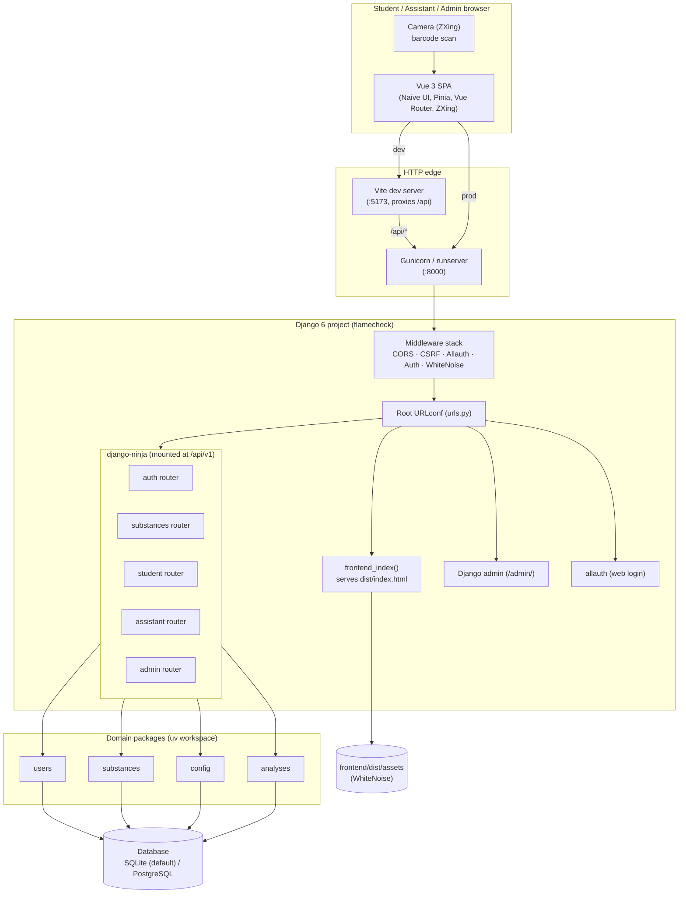
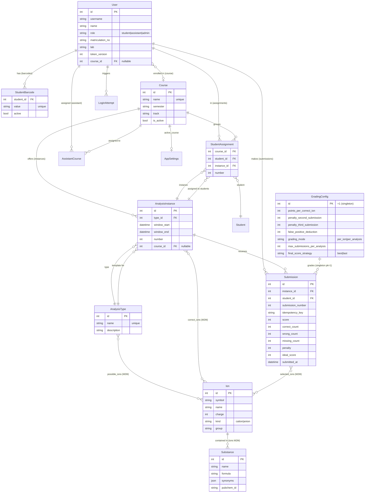
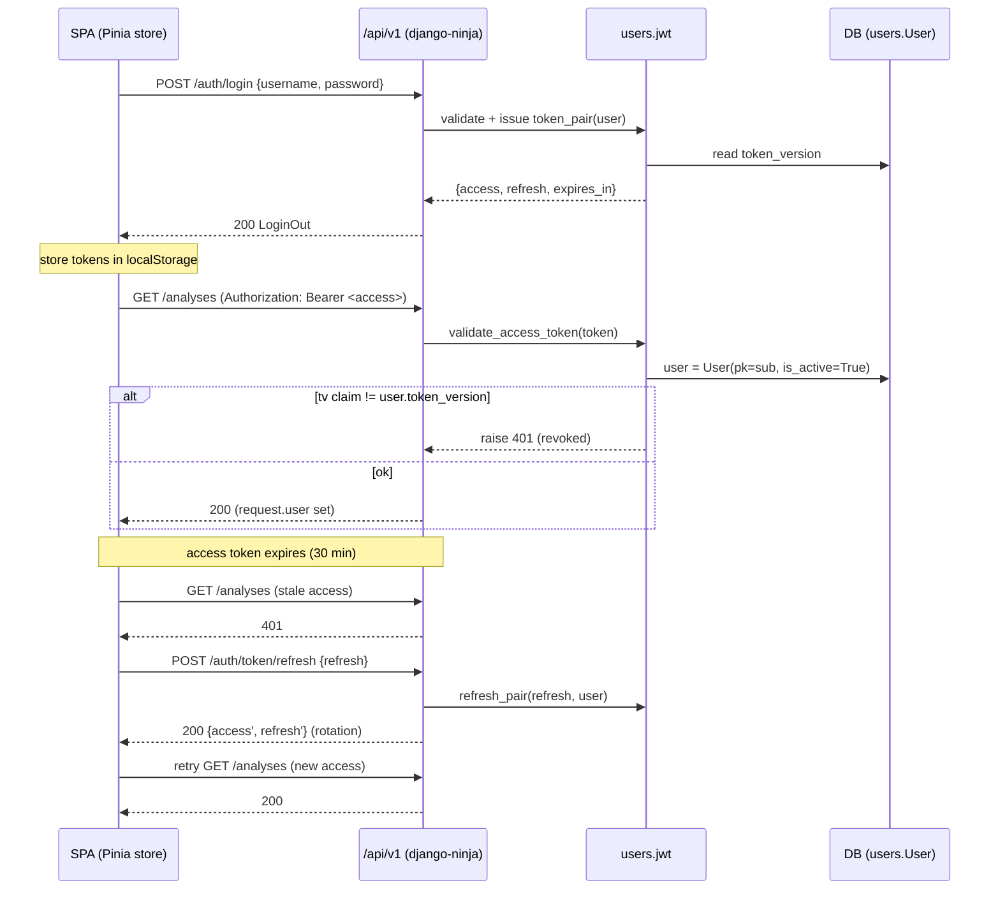
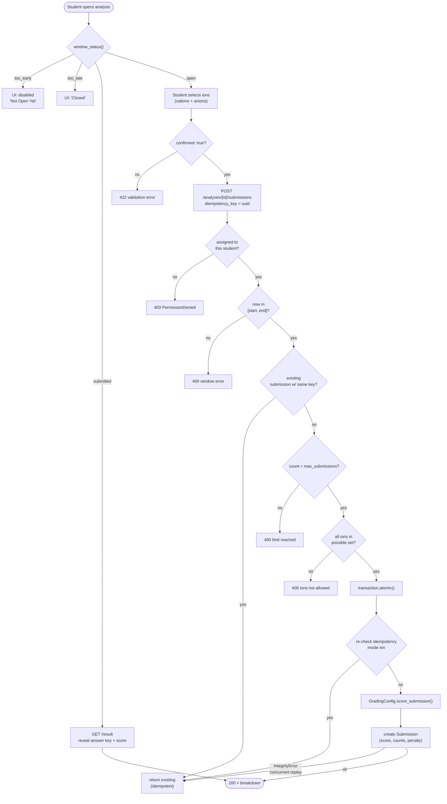
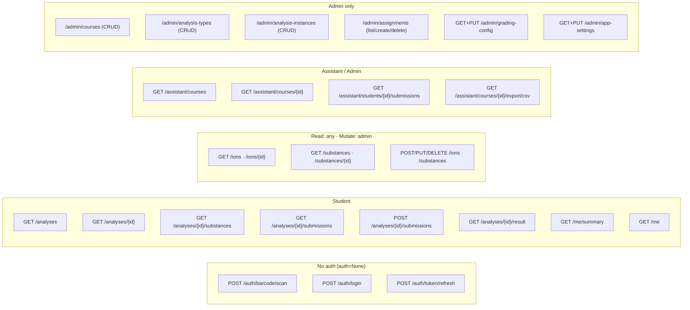
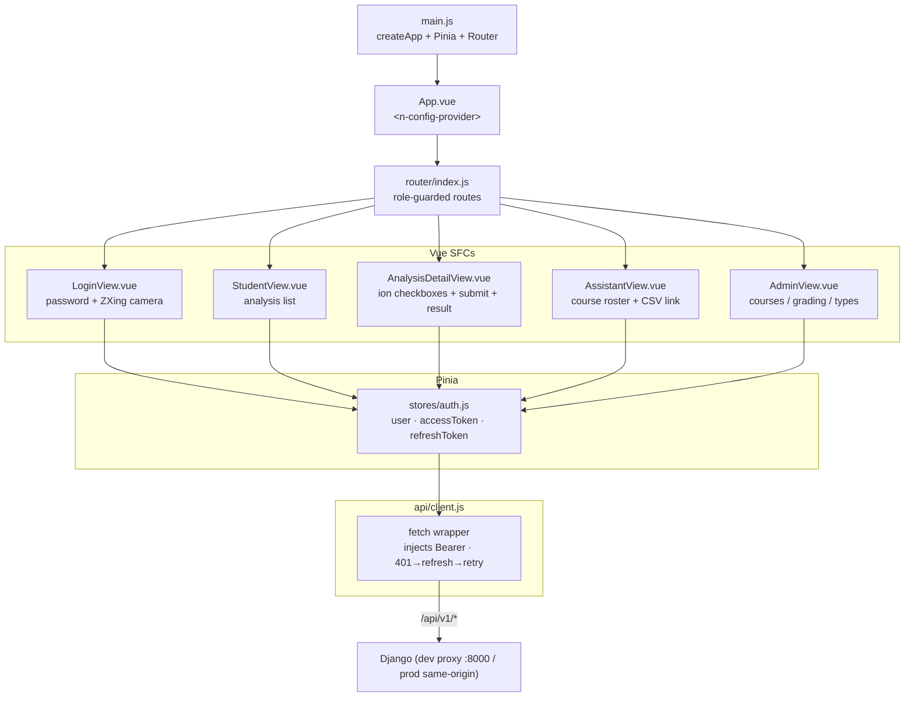

# FlameCheck — Architecture

> Companion to [`flamecheck_software_specification.md`](flamecheck_software_specification.md).
> This document describes **how** the system is built: the technical stack, the module
> layout, the domain model, the request lifecycle, the API surface and the frontend.

FlameCheck is a web system for first-semester inorganic chemistry students to submit the
results of qualitative ion analyses. Students authenticate with a **barcode** (or, as a
fallback, username/password or SSO), then — within a **time window** controlled by the
assistant — select the cations and anions they detected and submit. Submissions are
graded automatically, are **immutable and timestamped**, and support **idempotent
retries** with a configurable penalty. Assistants see a per-course roster and statistics
and can export an audit CSV; administrators manage courses, analysis types, instances,
assignments and the global grading configuration.

---

## 1. Technology stack

| Concern          | Choice | Notes |
|------------------|--------|-------|
| Language         | Python 3.13 | Modern syntax (`X \| Y`, `match`/`case`) |
| Web framework    | Django 6.x | Project config lives in `src/flamecheck/` |
| REST API         | **django-ninja** 1.x | OpenAPI docs, schema validation, typed routers |
| Auth (API)       | **PyJWT** (HS256) | Bearer tokens; `token_version` claim for revocation |
| Auth (web)       | django-allauth | Username + email login methods (SSO-ready) |
| Frontend         | **Vite 7 + Vue 3** | Composition API, SFCs |
| State            | **Pinia** | One auth store |
| Routing (SPA)    | Vue Router | Role-guarded routes |
| UI kit           | **Naive UI** | Components (cards, tables, tabs, forms) |
| Barcode scanning | **@zxing/browser** | Camera-based multi-format reader |
| Package manager  | **uv** (workspace) | 4 member packages + root project |
| Static serving   | Whitenoise | Serves `frontend/dist/assets` in prod |
| Database         | **SQLite (default)** | `db.sqlite3` at repo root; no external service |
| Database (opt-in)| PostgreSQL | `psycopg` driver, enabled via `DATABASE_URL` |
| DB (test)        | SQLite | In-memory (`:memory:`) for speed |
| Server (prod)    | Gunicorn | ASGI/WSGI entrypoints in `src/flamecheck/` |
| Lint / format    | ruff | Rules `B D C4 S F E W UP I RUF`, line length 120 |
| Tests            | pytest + pytest-django | 73 tests, coverage to `coverage.xml` |

The Python code is organised as a **uv workspace**: a root `flamecheck` project (Django
settings, URLs, API wiring) plus four member packages under `packages/`.

---

## 2. Repository layout

```
flamecheck/
├── pyproject.toml              # Root project + uv workspace + ruff/pytest/mypy config
├── .env-template               # env template (copy to .env): DB, JWT, hosts, …
├── manage.py
├── justfile                    # docker compose task runner
├── src/flamecheck/             # The Django project (importable as `flamecheck`)
│   ├── settings/{__init__,base,development,production,test}.py
│   ├── urls.py                 # Root URLconf (admin, allauth, API, SPA catch-all)
│   ├── api/__init__.py         # NinjaAPI instance + router registration
│   ├── wsgi.py / asgi.py
│   └── audit.py                # Audit log configuration
├── packages/                   # uv workspace members
│   ├── users/                  # User, barcodes, JWT auth, login API
│   │   └── src/users/
│   │       ├── models.py       # User, StudentBarcode, LoginAttempt, StudentAssignment
│   │       ├── jwt.py          # Token issue/validate/refresh helpers
│   │       ├── api/{jwt_auth.py, views.py, schemas.py}
│   │       ├── management/commands/{init_barcode,init_admin,...}.py
│   │       └── admin.py
│   ├── substances/             # Ion + Substance catalog
│   │   ├── data/{ions.json, substances.json}   # Seed catalog
│   │   └── src/substances/
│   │       ├── models.py
│   │       ├── api/{views.py, schemas.py}
│   │       └── management/commands/import_catalog.py
│   ├── config/                 # Course, GradingConfig, AppSettings, AssistantCourse
│   │   └── src/config/
│   │       ├── models.py
│   │       └── admin.py
│   └── analyses/               # AnalysisType, AnalysisInstance, Submission, scoring
│       └── src/analyses/
│           ├── models.py       # Domain logic: window status, atomic submit, scoring
│           ├── api/{student.py, assistant.py, admin.py, schemas.py}
│           └── management/
├── frontend/                   # Vite + Vue 3 app (independent package.json)
│   ├── package.json
│   ├── vite.config.js          # Dev proxy /api → :8000, build → dist/
│   ├── index.html
│   └── src/
│       ├── main.js / App.vue
│       ├── router/index.js     # Role-guarded routes
│       ├── stores/auth.js      # Pinia auth store (JWT + refresh)
│       ├── api/client.js       # fetch wrapper with 401→refresh→retry
│       └── views/{LoginView, StudentView, AnalysisDetailView,
│                   AssistantView, AdminView}.vue
├── tests/                      # pytest suite (django_db, fixtures in conftest.py)
├── docker/                     # Dockerfiles + compose + entrypoints
└── docs/                       # Sphinx docs (installation, usage, development/)
```

---

## 3. High-level system architecture



**Key separation of concerns**

- The **SPA** is a standalone Vite app. In development the Vite dev server on `:5173`
  proxies `/api` to the Django dev server on `:8000`. In production the built `dist/`
  is served by Django itself: non-API routes fall through to `frontend_index()`, and
  static assets are served by WhiteNoise from `STATICFILES_DIRS`.
- **django-ninja** owns the entire `/api/v1` surface. It is mounted once from the root
  URLconf (see §7 for the routing subtlety).
- The **four domain packages** contain models + business logic; the API layer in each
  package is thin and delegates to model methods (e.g. `AnalysisInstance.submit()`).

---

## 4. Domain model (entities & relationships)



**Entity notes**

- **`User`** extends `AbstractUser` and adds `role`, `name`, `matriculation_no`,
  `lab`, `labspace_id`, a nullable FK to `Course`, and `token_version` (bumped on
  logout to revoke all outstanding JWTs).
- **`StudentBarcode`** maps a student to a printable/scan-able value (`FC-<id>-<uuid8>`);
  login by barcode is a pure server-side lookup (the client never learns whether a value
  exists — an unknown or inactive value yields a generic 401).
- **`AnalysisType`** is the *template* (e.g. "Analysis 3") with the **possible ion set**.
  **`AnalysisInstance`** is a *concrete session*: a specific time window, a number, an
  optional course, and the **correct ion set** (the answer key — never exposed to
  students before submission).
- **`StudentAssignment`** links a student to an instance (within a course) and carries
  the student's `number`. It is what makes an instance "owned" by a student.
- **`Submission`** is immutable (`submitted_at` is `auto_now_add`, no update path) and
  carries the full grading breakdown. A `UniqueConstraint(instance, student,
  idempotency_key)` is the final concurrency guard for idempotent replays.
- **`GradingConfig`** is a singleton (`pk=1`) holding all scoring parameters.
- **`AppSettings`** (singleton) holds `points_per_analysis`, `analyses_per_course` and
  the currently `active_course`.

---

## 5. Authentication & authorisation

### 5.1 JWT design

Two HS256 tokens are issued together: an **access** token (30 min) and a **refresh**
token (14 days). The payload:

```jsonc
{
  "sub":  "<user id>",
  "jti":  "<uuid hex>",        // unique per token
  "type": "access" | "refresh",
  "role": "student|assistant|admin",
  "iat":  1720000000,
  "exp":  1720001800,
  "aud":  "flamecheck-api",
  "iss":  "flamecheck",
  "tv":   0                     // token_version (revocation)
}
```

`aud`/`iss` are embedded in the payload (PyJWT's `encode()` does not accept them as
kwargs). **Revocation** works by comparing the `tv` claim against the user's current
`token_version`; `POST /auth/logout` bumps that column, instantly invalidating every
token minted earlier.



The `JWTBearerAuth` handler (a `ninja.security.HttpBearer`) validates the token and sets
`request.user` directly. It is the **global** auth on the `NinjaAPI`; individual routes
opt out with `auth=None` (the two login endpoints and refresh).

### 5.2 Role-based authorisation

Roles are checked **inside** the view layer, not via Django middleware:

| Endpoint group | Guard | Behaviour for wrong role |
|----------------|-------|--------------------------|
| `/analyses/...` (student) | `request.user.is_student` | 404 for non-owner, 403 for non-student |
| `/assistant/...` | `is_assistant or is_admin` | 401 unauthenticated, 403 student |
| `/admin/...` | `is_admin` | 401 unauthenticated, 403 others |
| substance mutations | `_require_admin` | 403 non-admin |

The SPA additionally gates routes by `meta.roles` in the Vue Router, so a student cannot
even navigate to the assistant/admin screens.

### 5.3 Brute-force protection

`LoginAttempt` records each failed login (username, IP, timestamp). After
`LOGIN_MAX_ATTEMPTS` (5) failures within the window the endpoint returns a
`ValidationError` ("Too many failed attempts. Try again later.") — a cache-backed
rate limit also caps request volume per key.

---

## 6. The submission lifecycle (core business flow)



### 6.1 Scoring

`GradingConfig.score_submission()` grades one submission. Two modes:

- **`per_ion`** (default): `score = correct × points_per_correct_ion
  − wrong × false_positive_deduction − retry_penalty`, floored at 0.
  The retry penalty applies from the 2nd submission onward
  (`penalty_second_submission` for the 2nd, `penalty_third_submission` for the 3rd+).
- **`per_analysis`**: `score = points_per_correct_ion` **iff** the selected set exactly
  equals the correct set, else 0.

The **final score** for an instance is chosen by `final_score_strategy`: `best`
(maximum across submissions, the default) or `last` (the most recent). The *ideal*
score is `correct_count × points_per_correct_ion` (per_ion) or `points_per_correct_ion`
(per_analysis).

### 6.2 Idempotency & concurrency

A client-generated `idempotency_key` (a UUID) is scoped to
`(instance, student, key)`. The code checks for an existing submission **twice** —
once before the transaction and once inside it — and the database `UniqueConstraint`
is the final arbiter under a concurrent replay race: if `create()` raises
`IntegrityError`, the original submission is fetched and returned instead.

---

## 7. API surface

All routes are under `/api/v1/`. The OpenAPI schema is at `/api/v1/openapi.json` and the
interactive docs at `/api/v1/docs` (DEBUG only).



**Response conventions**

- Success bodies are JSON rendered from ninja `Schema` types (or plain `dict`).
- Errors use standard HTTP semantics: `400` (window/limit/allowlist), `401`
  (unauthenticated / revoked token), `403` (wrong role), `404` (not found / not owner),
  `409` (deletion blocked, e.g. instance has submissions), `422` (schema validation).
- The correct ion set is **never** included in student-facing detail responses; it only
  appears in the `result` endpoint after submission and in the assistant CSV.

### 7.1 The `/api/v1` routing subtlety (important)

django-ninja's `api.urls` returns a 3-tuple `(patterns, app_name, namespace)`, and its
patterns are `RoutePattern`s with `endpoint=True` (exact match, no trailing slash).
Two Django 6 quirks make mounting non-trivial:

1. **Django 6's `include()` rejects 3-tuples.** So the tuple is unpacked **exactly
   once** at module import in the URLconf — accessing `api.urls` a second time in the
   same process raises `ninja.errors.ConfigError`.
2. **The root resolver strips the leading slash** before delegating to sub-resolvers.
   A sub-pattern of `"/api/v1/"` therefore never matches the remaining path
   `"api/v1/me"`. The pattern must be **`"api/v1/"`** (no leading slash, with a
   trailing slash) so that `removeprefix` leaves the clean remainder (`"me"`), which the
   exact-match ninja endpoint then accepts.

The working mount:

```python
# src/flamecheck/urls.py
api_url_path = settings.API_PREFIX.lstrip("/") + "/"          # "api/v1/"
from flamecheck.api import api
_ninja_patterns, _ninja_app_name, _ninja_namespace = api.urls  # once only
urlpatterns = [
    path("admin/", admin.site.urls),
    path(api_url_path, include((_ninja_patterns, _ninja_app_name), namespace="api")),
    path("", include("allauth.urls")),
    path("accounts/", include("users.urls")),
    path("", frontend_index, name="frontend-index"),            # SPA catch-all
]
```

---

## 8. Frontend architecture



- **Auth store** keeps `user`, `accessToken`, `refreshToken` (persisted to
  `localStorage`). `login()` / `scanBarcode()` mint and store the pair; `refresh()`
  rotates them; `logout()` invalidates on the server and clears state.
- **API client** is a thin `fetch` wrapper: it injects the `Authorization` header and,
  on a `401`, calls `auth.refresh()` once and retries the original request.
- **Router guard** redirects unauthenticated users to `/login`, redirects
  authenticated users away from the public page, and blocks navigation to routes whose
  `meta.roles` do not include the user's role.
- **Barcode login** uses `@zxing/browser` `BrowserMultiFormatReader` on a video device,
  with a manual-entry fallback; both funnel into `auth.scanBarcode()`.

---

## 9. Settings & environments

`src/flamecheck/settings/` splits configuration into four modules:

| Module | `DJANGO_SETTINGS_MODULE` | Purpose |
|--------|--------------------------|---------|
| `base.py` | — | Shared config (apps, middleware, auth, JWT, static, **DB default**) |
| `development.py` | `flamecheck.settings` (default) | DEBUG, CORS, reload |
| `production.py` | `flamecheck.settings.production` | Gunicorn, WhiteNoise, secure cookies |
| `test.py` | `flamecheck.settings.test` | In-memory SQLite, MD5 hasher (fast) |

The **database is configured in `base.py`** from `DATABASE_URL`
(`django-environ`). The default is **SQLite** at `db.sqlite3`; any engine can
be selected by setting `DATABASE_URL` in `.env` (e.g. a `postgres://` URL) —
no change to the other modules is needed. `production.py` inherits the same
default and therefore runs on SQLite unless `DATABASE_URL` is overridden.

Key settings: `AUTH_USER_MODEL = "users.User"`, `API_PREFIX = "/api/v1"`,
`DATABASE_URL` (default `sqlite:///<repo>/db.sqlite3`),
`JWT_ACCESS_TOKEN_LIFETIME_MINUTES = 30`, `JWT_REFRESH_TOKEN_LIFETIME_DAYS = 14`,
`LOGIN_MAX_ATTEMPTS = 5`, `STATICFILES_DIRS = [frontend/dist/assets]`,
`CATALOG_DIR = packages/substances/data`.

---

## 10. Data seeding & management commands

| Command | Package | Effect |
|---------|---------|--------|
| `import_catalog` | substances | Loads `ions.json` (22 ions) + `substances.json` (35 substances) idempotently (`get_or_create` by `(symbol, kind)` / `name`) |
| `init_barcode` | users | Creates a test barcode `FC-<id>-<uuid8>` (`--reset` to regenerate) |
| `init_admin` | users | Creates an admin user |
| `init_django` | users | Legacy bootstrap (references `LOCAL_APPS`/`FIXTURES`) |
| `wait_for_db` | users | Blocks until the database is reachable (Docker) |

---

## 11. Security & audit

- **Passwords** are hashed (Argon2 in production, MD5 in tests for speed).
- **JWT revocation** via the `token_version` column (see §5.1).
- **Brute-force lockout** via `LoginAttempt` + cache rate limiting (§5.3).
- **Answer-key confidentiality**: the correct ion set is excluded from student detail
  and only revealed post-submission (§7).
- **Immutable submissions**: `submitted_at` is `auto_now_add`, no update endpoint, and
  `PROTECT` FKs prevent deleting an instance/type that has submissions.
- **Audit logging**: a dedicated `flamecheck.audit` logger records admin mutations and
  every accepted/rejected submission (student, instance, score, breakdown).
- **CSRF** is handled by Django middleware for the web/allauth paths; the API is
  stateless (Bearer tokens) and thus CSRF-exempt by design.

---

## 12. Testing

The pytest suite (`tests/`, run with `uv run pytest`) is marked `django_db`. Test data
is generated with **factory-boy + Faker**: each Django app owns a `factory.py`
(`users`, `substances`, `config`, `analyses`) exposing `DjangoModelFactory` subclasses
that use `Faker` (realistic values), `Sequence` (uniqueness), `SubFactory` (object
graphs), `LazyFunction`/`LazyAttribute` (build-time values), `post_generation`
(optional M2M/FK relations), `django_get_or_create` (idempotent natural-key creation),
`create_batch`, and named helpers (`IonFactory.make('copper')`,
`AnalysisInstanceFactory.make(window='too_early')`). `UserFactory` uses a custom
`_create` that routes through `create_user`/`create_superuser` so passwords are hashed,
with `AdminUserFactory`/`AssistantUserFactory` role sub-factories.

The shared fixtures in `tests/conftest.py` are thin wrappers over these factories
(student/assistant/admin users, a course, a 10-ion catalog, an open-window instance
with correct set `{NH4⁺, SO₄²⁻, Cu²⁺}`, and a fresh-minted-token `auth_headers`
fixture), and `tests/test_factories.py` exercises the factories themselves. Coverage is
reported to `coverage.xml`. Suites cover: auth (login, barcode, refresh rotation, logout
revocation, `/me`), submission window logic (open/early/late/disallowed/ion-allowlist),
idempotent replay, submission limits, retry penalties, per-ion and per-analysis scoring,
the result and summary endpoints, assistant course visibility/roster/CSV, and admin
CRUD + role guards.
